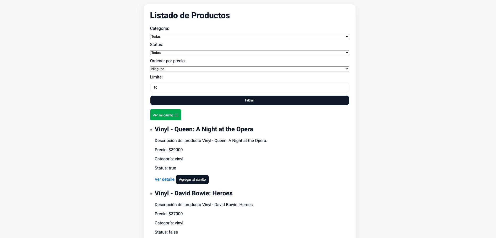
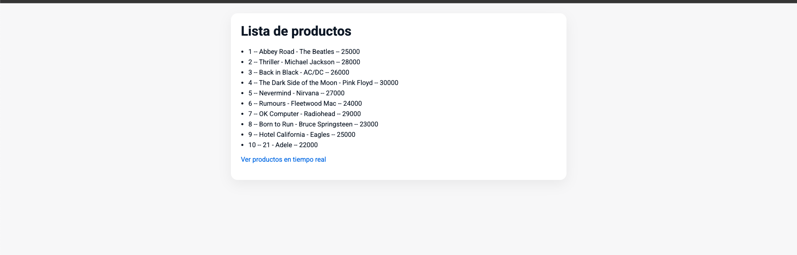
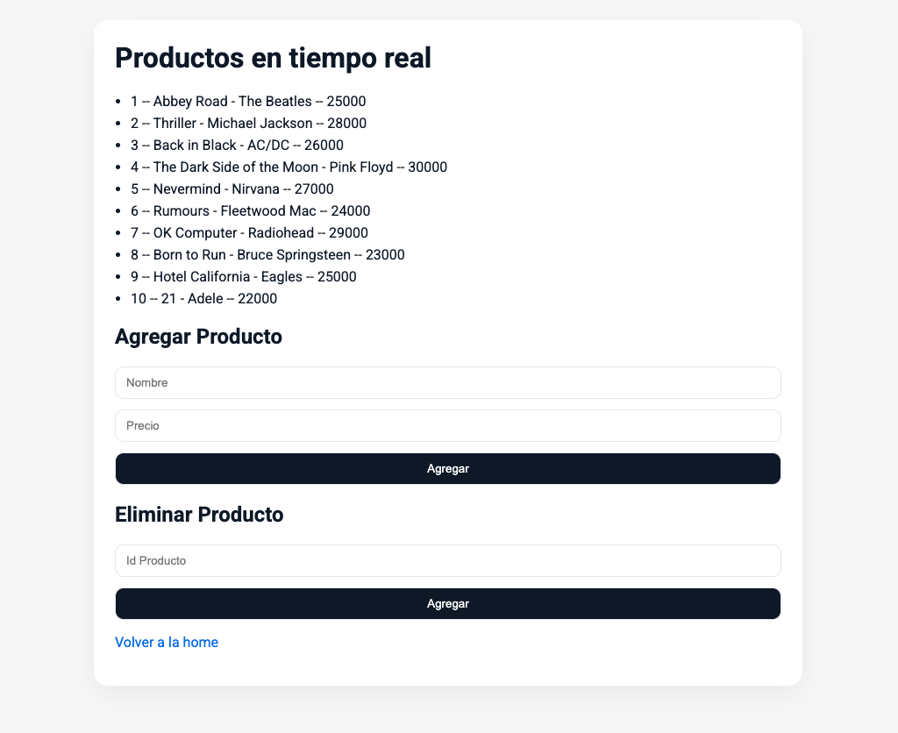

# Entrega Final - Programación Backend I

**Curso:** Desarrollo Avanzado de Backend  
**Comisión:** 77525  
**Alumna:** María Pía Zaniboni  
**LinkedIn:** [https://www.linkedin.com/in/pia-zaniboni/](https://www.linkedin.com/in/pia-zaniboni/)

---

## 🎯 Objetivos de la entrega final

- Utilizar **MongoDB** como sistema de persistencia principal.  
- Definir y profesionalizar todos los endpoints para gestionar **productos** y **carritos**.  
- Implementar filtros, paginación y ordenamientos en consultas.  
- Optimizar la gestión de carritos aplicando los últimos conceptos vistos en el curso.  

---

## 🚀 Instalación y ejecución

1. Clonar este repositorio:
   ```bash
   git clone https://github.com/PiaZaniboni/comision-77525-maria-pia-zaniboni
   cd comision-77525-maria-pia-zaniboni
   ```

2. Instalar dependencias:
   ```bash
   npm i
   ```

4. Levantar la aplicación:
   ```bash
   npm run dev
   ```

---

## 🖼️ Capturas de la Entrega Final

- **/products**  
  - Visualización de productos con **paginación**.  
  - Cada producto puede:  
    - Llevar a `/products/:pid` para ver detalle completo.  
    - Agregarse al carrito directamente con un botón.  


- **/carts/:cid**  
  - Vista de un carrito específico con productos listados y detallados.  


### Vista Home
Muestra todos los productos agregados hasta el momento:  


### Vista RealTimeProducts
Lista de productos que se actualiza automáticamente en tiempo real:  

